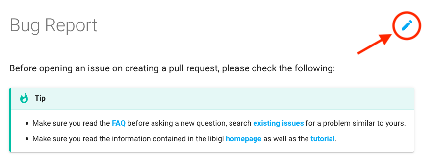

# Building the Website

For developers who want to contribute to the website/documentation of libigl.
The website is now hosted in [its own repository](https://github.com/libigl/libigl.github.io)
separate from the main libigl repository.

## Simple Workflow

1. For simple edits to the website, you can directly edit the pages online:
  

2. Write your changes to the markdown file on github:
  

3. Preview the modified page on github:
  

4. Finally, commit the changes to a new branch/fork and let github create a pull request with your changes:
  

Feel free to make your changes locally, and use something like dynamic previews in [VS Code](https://code.visualstudio.com/docs/languages/markdown) to preview your changes.
The files are just markdown so anything should work! For more complicated changes (e.g. to render math equations), you may want to run [mkdocs](https://www.mkdocs.org/) to preview the final website.

## Final Website Preview 

For more complicated changes, you may want to preview the website locally on your machine while editing its content.
You will need to run [mkdocs](https://www.mkdocs.org/) to do this. 
If you want to preview the website locally on your machine, you will need to run [mkdocs](https://www.mkdocs.org/)

### Prerequisites

```bash
python -m pip install -r requirements.txt
```

### Render the Website

```bash
mkdocs serve
```

!!! tip

    Dead links can be checked using the [LinkChecker](https://linkchecker.github.io/linkchecker/)
    tool. Run the website locally, then run LinkChecker on it:
    ```bash
    linkchecker http://127.0.0.1:8000
    ```

### Doxygen

Doxygen documentation is generated from withing libigl source. Run 

    cd libigl
    doxygen docs/doxygen.conf

### Deployment

Deployment has been automated through the use of GitHub Actions. The configuration file is located [here](https://github.com/libigl/libigl.github.io/blob/docs/.github/workflows/gh-pages.yml).


## References

- [MkDocs](http://www.mkdocs.org/)
- [Material Theme](https://squidfunk.github.io/mkdocs-material/)
